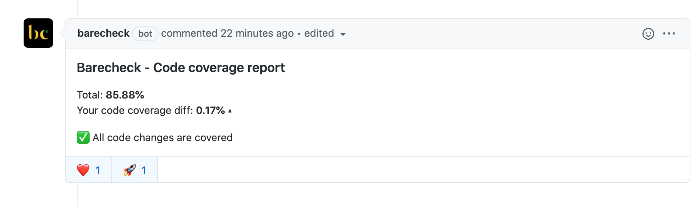
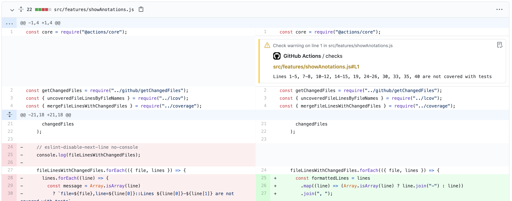
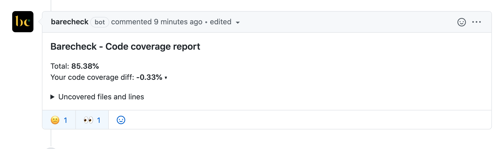

# code-coverage-action

GitHub Action that generates coverage reports



## Installation

1. Install [Barecheck Application](https://github.com/apps/barecheck)
2. Copy the token provided on the authorization confirmation page and [add it to your build environment](https://docs.github.com/en/actions/reference/environment-variables) as BARECHECK_GITHUB_APP_TOKEN
3. Create Github Actions worrkflow from the [example](https://github.com/barecheck/code-coverage-action#workflow-example)

## Features

### Show annotations

As a part of code coverage report action also enable an ability to show annotations along with changed lines to keep control what is covered with tests without interapting review process



### Show uncovered files

In the rea; world, it's hard to get 100% code coverage and keep it all the time. Instead of showing you all uncovered files Barecheck show only the ones you have changed.


## Usage

To integrate with this Github Action, you can just use following configuration in your already created workflow. As a result you will get Github Pull request comment with total code coverage

```yml
- name: Generate Code Coverage report
  id: code-coverage
  uses: barecheck/code-coverage-action@v0.5.1
  with:
    barecheck-github-app-token: ${{ secrets.BARECHECK_GITHUB_APP_TOKEN }}
    lcov-file: "./coverage/lcov.info"
    base-lcov-file: "./coverage/base-lcov.info"
    send-summary-comment: true
    show-annotations: "warning"
```

## Arguments

## Inputs

| Key                          | Required | Default     | Description                                                                                                                                  |
| ---------------------------- | -------- | ----------- | -------------------------------------------------------------------------------------------------------------------------------------------- |
| `github-token`               | **yes**  | -           | Default Github Actions token. Token is not requered if Github application is installed and token passed through `barecheck-github-app-token` |
| `lcov-file`                  | **yes**  | -           | Lcov.info file that was generated after your test coverage command                                                                           |
| `barecheck-github-app-token` | **no**   | -           | Barecheck application token, received after application installation comment.                                                                |
| `base-lcov-file`             | **no**   | -           | Lcov.info file that would be used to compare code coverage. The comparision will be disabled if the file is not passed                       |
| `send-summary-comment`       | **no**   | true        | Option to send Github code coverage comment based on the changes that were made in PR                                                        |
| `show-annotations`           | **no**   | 'warning'   | Option to enable Github anotation that would show uncovered files in review tab. Options: ' ' \| warning \| error                            |
| `minimum-ratio`              | **no**   | ''          | Percantage of uncovered lines that is allowed for new changes                                                                                |
| `app-name`                   | **no**   | 'Barecheck' | Application name would be used once you have more than one report in your workflow and want to have different reports per application.       |

## Workflow Example

In order to compare your new changes report and base branch you are able to use Github artifacts as in the example below:

```yml
name: Code Coverage

on: [pull_request]

jobs:
  base_branch_cov:
    runs-on: ubuntu-latest
    steps:
      - uses: actions/checkout@v2
        with:
          ref: ${{ github.base_ref }}
      - name: Use Node.js v16.11.0
        uses: actions/setup-node@v1
        with:
          node-version: v16.11.0

      - name: Install dependencies
        run: yarn

      - name: Run test coverage
        run: yarn coverage

      - name: Upload code coverage for ref branch
        uses: actions/upload-artifact@v2
        with:
          name: ref-lcov.info
          path: ./coverage/lcov.info

  checks:
    runs-on: ubuntu-latest
    needs: base_branch_cov
    steps:
      - uses: actions/checkout@v2
      - name: Use Node.js v16.11.0
        uses: actions/setup-node@v1
        with:
          node-version: v16.11.0

      - name: Download code coverage report from base branch
        uses: actions/download-artifact@v2
        with:
          name: ref-lcov.info

      - name: Install dependencies
        run: yarn

      - name: Run test coverage
        run: yarn coverage

      #  Compares two code coverage files and generates report as a comment
      - name: Generate Code Coverage report
        id: code-coverage
        uses: barecheck/code-coverage-action@v0.5.1
        with:
          barecheck-github-app-token: ${{ secrets.BARECHECK_GITHUB_APP_TOKEN }}
          lcov-file: "./coverage/lcov.info"
          base-lcov-file: "./lcov.info"
          minimum-ratio: 0 # Fails Github action once code coverage is decreasing
          send-summary-comment: true
          show-annotations: "warning" # Possible options warning|error
```

## Use cases

### Monorepo support

If you have monorepo with more then one application and want to have different code coverage reports you can use `app-name` input property to define different application names that would be used as a part of title.

```yml
- name: Application1 - Generate Code Coverage report
  id: code-coverage
  uses: barecheck/code-coverage-action@v0.5.1
  with:
    barecheck-github-app-token: ${{ secrets.BARECHECK_GITHUB_APP_TOKEN }}
    lcov-file: "./coverage/lcov.info"
    base-lcov-file: "./coverage/base-lcov.info"
    app-name: "Application 1"
```

```yml
- name: Application2 - Generate Code Coverage report
  id: code-coverage
  uses: barecheck/code-coverage-action@v0.5.1
  with:
    barecheck-github-app-token: ${{ secrets.BARECHECK_GITHUB_APP_TOKEN }}
    lcov-file: "./coverage/lcov.info"
    base-lcov-file: "./coverage/base-lcov.info"
    app-name: "Application 2"
```

## Contributing

- Clone this repository
- Use current node.js version `nvm use` or `nvm install`
- Run `yarn install`
- Develop feature/fix
- Run `yarn build`
- Commit changes including `./dist/index.js` bundle
- Create Pull request
