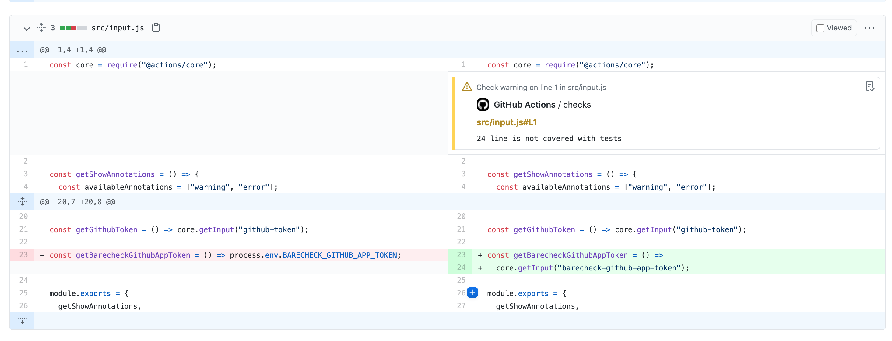

# code-coverage-action

GitHub Action that generates coverage reports


## Show annotations

As a part of code coverage report action also enable an ability to show annotations along with changed lines to keep control what is covered with tests without interapting review process



## Usage

To integrate with this Github Action, you can just use following configuration in your already created workflow. As a result you will get Github Pull request comment with total code coverage

```yml
- name: Generate Code Coverage report
  id: code-coverage
  uses: barecheck/code-coverage-action@v0.3.3
  with:
    github-token: ${{ secrets.GITHUB_TOKEN }}
    lcov-file: "./coverage/lcov.info"
    base-lcov-file: "./coverage/base-lcov.info"
    send-summary-comment: true
    show-annotations: "warning"
```

## Arguments

## Inputs

| Key                    | Required | Default   | Description                                                                                                       |
| ---------------------- | -------- | --------- | ----------------------------------------------------------------------------------------------------------------- |
| `github-token`         | **yes**  | -         | Your Github token that would be used to send summary comment                                                      |
| `lcov-file`            | **yes**  | -         | Lcov.info file that was generated after your test coverage command                                                |
| `base-lcov-file`       | **yes**  | -         | Lcov.info file that would be used for code coverage                                                               |
| `send-summary-comment` | **no**   | true      | Option to send Github code coverage comment based on the changes that were made in PR                             |
| `show-annotations`     | **no**   | 'warning' | Option to enable Github anotation that would show uncovered files in review tab. Options: ' ' \| warning \| error |
| `minimum-ratio`        | **no**   | ''        | Percantage of uncovered lines that is allowed for new changes                                                     |

## Workflow Example

In order to compare your new changes report and base branch you are able to use Github artifacts as in the example below:

```yml
name: Code Coverage

on: [pull_request]

jobs:
  base_branch_cov:
    runs-on: ubuntu-latest
    steps:
      - uses: actions/checkout@v2
        with:
          ref: ${{ github.base_ref }}
      - name: Use Node.js 14.16.1
        uses: actions/setup-node@v1
        with:
          node-version: 14.16.1

      - name: Install dependencies
        run: yarn

      - name: Run test coverage
        run: yarn coverage

      - name: Upload code coverage for ref branch
        uses: actions/upload-artifact@v2
        with:
          name: ref-lcov.info
          path: ./coverage/lcov.info

  checks:
    runs-on: ubuntu-latest
    needs: base_branch_cov
    steps:
      - uses: actions/checkout@v2
      - name: Use Node.js 14.16.1
        uses: actions/setup-node@v1
        with:
          node-version: 14.16.1

      - name: Download code coverage report from base branch
        uses: actions/download-artifact@v2
        with:
          name: ref-lcov.info

      - name: Install dependencies
        run: yarn

      - name: Run test coverage
        run: yarn coverage

      #  Compares two code coverage files and generates report as a comment
      - name: Generate Code Coverage report
        id: code-coverage
        uses: barecheck/code-coverage-action@v0.3.3
        with:
          github-token: ${{ secrets.GITHUB_TOKEN }}
          lcov-file: "./coverage/lcov.info"
          base-lcov-file: "./lcov.info"
          minimum-ratio: 0 # Fails Github action once code coverage is decreasing
          send-summary-comment: true
          show-annotations: "warning" # Possible options warning|error
```

## Contributing

- Clone this repository
- Use current node.js version `nvm use` or `nvm install`
- Run `yarn install`
- Develop feature/fix
- Run `yarn build`
- Commit changes including `./dist/index.js` bundle
- Create Pull request
